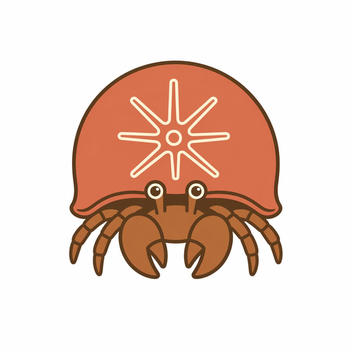

<div align="center">



# Hermit Agent

**Not a standalone agent framework — a hermit crab that lodges inside Claude Code. One command bootstraps a Telegram-connected Claude Code agent with persona, long-term memory, scheduler, and browser automation.**

[English](README.md) · [中文](README.zh-CN.md)

[](https://www.npmjs.com/package/create-hermit-agent)
[](LICENSE)
[](https://nodejs.org)
[](https://www.apple.com/macos/)
[](https://docs.claude.com/claude-code)

</div>

---

## Why a hermit crab?

Claude doesn't expose a third-party subscription surface — no webhook, no event bus, no pub-sub channel to register as an outside listener. If you want an always-on agent that chats on Telegram, runs cron, browses the web, and remembers things across restarts, you have to run a Claude client yourself. Rather than build yet another standalone agent framework on top (another CLI, another runtime, another process manager), Hermit Agent takes the hermit-crab approach: lodge **inside** Claude Code — **borrow the shell** (Claude Code's CLI, tool harness, and the plugin / MCP / channel / hook extension points it opens up locally), **bring your own body** (the markdown persona files, memory modules, skills, and hooks that make this particular agent *yours*).

The body itself fuses patterns from three earlier projects — nothing in this repo is a blank-slate invention.

| Borrowed from | What it contributed |
|---|---|
| **[Claude Code](https://docs.claude.com/claude-code)** | The shell. Every agent literally runs inside `claude --dangerously-skip-permissions`. Plugins, MCP, tools, hooks — all native, nothing reimplemented. |
| **OpenClaw** | The self-managed-browser pattern. Shaped `scripts/chrome-launcher.sh`, `scripts/browser-lock.sh`, per-agent Chrome profile + CDP reuse, stealth-wrapped Playwright. |
| **Hermas Agent** | The autonomous-evolution pattern and memory-module design. `SOUL.md` + `MEMORY.md` + daily `memory/YYYY-MM-DD.md` logs + dream-style consolidation are all inherited. |

---

## 30-second quickstart

```bash
# Prereqs: Claude Code installed & logged in, Node 18+, brew install tmux jq, bun installed
npx create-hermit-agent
cd asst && ./start.sh
```

Open Telegram, DM the bot you just registered with @BotFather. First DM triggers a one-shot orientation — then the agent stays out of your way.

> **You:** remind me at 3pm to call mom  
> **asst:** scheduled — I'll ping you at 3pm today.

---

## Feature matrix

| Capability | Detail |
|---|---|
| **Persona** | `SOUL / IDENTITY / USER / AGENTS / TOOLS / MEMORY.md` loaded every session. Edit the files → edit the agent. |
| **Long-term memory** | Daily logs at `memory/YYYY-MM-DD.md`, curated long-term at `MEMORY.md`. Survives restarts. |
| **Telegram I/O** | Native reply / react / edit / attachment download via `@claude-plugins-official/telegram`. Group-chat etiquette built in. `!!` sigil routes messages to Claude Code commands (`!!compact`, `!!model`, `!!status`). |
| **Lifecycle** | `start.sh` + `restart.sh` wrap the agent in a named `tmux` session. Push alerts when context crosses 100k / 200k / ... / 950k thresholds, or when tool use gets chatty. |
| **Scheduler** | Three tiers — session-only `cron` skill, cross-restart `HEARTBEAT.md`, OS-durable `launchd` plists. |
| **Browser** | Dedicated Chrome profile + CDP + Playwright + stealth-init anti-detection. |
| **Multi-agent** | `provision-agent` skill spawns siblings at `../<name>/` with their own bot tokens. Optional 10-min digest LaunchAgent. |
| **Safety** | Images forced through `safe-image.sh` resize (≤1800px long edge). Tokens stored at mode 600 outside the repo. Stop hook blocks turn-end if a Telegram DM got no reply. PreToolUse hook strips markdown from outbound Telegram replies so stray `**bold**` / `# headers` don't land as literal noise in the chat. |

---

## Architecture

```
┌────────────── Your Mac ──────────────┐       ┌─ Telegram ─┐
│                                       │       │            │
│  tmux session   claude-asst           │       │  Bot API   │
│  ┌───────────────────────────────┐   │       │            │
│  │  claude  (the borrowed shell)  │   │       │            │
│  │  ┌────────┐  ┌───────────────┐ │   │       │            │
│  │  │Persona │  │ Skills + Hooks│ │   │◄─────►│ @yourbot   │
│  │  │*.md    │  │ restart · cron│ │   │       │            │
│  │  │memory/ │  │ provision ... │ │   │       │            │
│  │  └────────┘  └───────────────┘ │   │       │            │
│  │     Telegram plugin (bun)      │   │       │            │
│  └────────────────────────────────┘   │       │            │
│                                       │       │            │
│  ~/.claude/channels/telegram-asst/    │       │            │
│    (bot token — not in the repo)       │       │            │
└───────────────────────────────────────┘       └────────────┘
```

Higher-res SVG: [assets/arch.svg](assets/arch.svg).

---

## Install

Prereqs (macOS):

- [Claude Code](https://docs.claude.com/claude-code) — installed and logged in (`claude login`)
- Node ≥ 18
- `brew install tmux jq`
- `curl -fsSL https://bun.sh/install | bash`

Scaffold:

```bash
npx create-hermit-agent
```

The CLI asks for a Telegram bot token ([@BotFather](https://t.me/BotFather)) and your own Telegram user ID ([@userinfobot](https://t.me/userinfobot)). Then it creates `./asst/`, installs the Telegram plugin at project scope, and writes the token to `~/.claude/channels/telegram-asst/.env` (mode 600).

Start:

```bash
cd asst && ./start.sh
```

The agent now runs in a detached `tmux` session named `claude-asst`. DM the bot.

---

## First DM: asst introduces itself

On first contact, asst sends a one-shot orientation — how to talk to it, available `!!` commands, how to spawn more agents — then deletes its own `FIRST_RUN.md` so it never greets you again.

---

## Spawning more agents

**Don't run `npx create-hermit-agent` a second time.** Tell asst:

> Create a new agent called `github-bot` with token `123:ABC...`. Purpose: triage my GitHub notifications.

asst's `provision-agent` skill scaffolds a sibling at `../github-bot/`, installs its plugin, starts it in a `claude-github-bot` tmux session, and replies with the new bot's `@handle`.

Agents are fully independent: separate bot tokens, separate memory, separate folders.

---

## Customize

Edit these in the agent folder:

| File | What to put there |
|---|---|
| `IDENTITY.md` | Name, vibe, one-line purpose |
| `USER.md` | You — pronouns, timezone, notes |
| `AGENTS.md` | `<!-- MISSION-START -->` block — this agent's mission |
| `TOOLS.md` | `<!-- AGENT-SPECIFIC-START -->` block — API keys, repo links, domain notes |

`SOUL.md` is baseline disposition — don't edit unless you want a different personality.

---

## Scheduled tasks

Just tell the agent what you want:

> Every 30 minutes, scan `memory/today.md` and flag urgent items.

asst's `cron` skill handles it. For tasks that must survive restarts, drop a plist into `~/Library/LaunchAgents/` — see `launchd/cron-example.plist.tmpl`.

---

## Multi-agent status digest

The CLI automatically installs a `launchd` coordinator the first time you run it on a machine. Every 10 minutes it pushes a digest of all hermits on the box to the coordinator's Telegram chat: 🟢 idle · 🟨 running · 🟥 stuck · ⚫ down.

- One coordinator per machine. When `create-hermit-agent` detects an existing `com.hermit-agent.*.status-reporter.plist`, it skips — subsequent hermits don't stack their own jobs.
- The first agent you install (default `asst`) is the coordinator. Its plist lives at `~/Library/LaunchAgents/com.hermit-agent.asst.status-reporter.plist`.
- To disable: `launchctl unload ~/Library/LaunchAgents/com.hermit-agent.<coordinator>.status-reporter.plist`.
- To hand off to a different coordinator: unload the old plist, delete it, re-run `create-hermit-agent` from a new agent (or manually `cp launchd/status-reporter.plist ~/Library/LaunchAgents/com.hermit-agent.<new>.status-reporter.plist && launchctl load ...`).

---

## Troubleshooting

| Symptom | Fix |
|---|---|
| Agent doesn't reply | `tmux attach -t claude-<name>` to see live state. Also check `restart.log`, `claude-agent.log`. |
| Plugin subprocess missing | `./restart.sh` auto-retries once. Still broken? Check `~/.claude/channels/telegram-<name>/.env` is mode 600 with the token. |
| `exceeds the dimension limit` image crash | All image Reads MUST go through `scripts/safe-image.sh` first. Recover with restart + `/compact`. |
| `claude plugin install failed` | Ensure `claude` is on PATH and logged in (`claude login`). |
| Context bloat | Send `!!compact` from Telegram, or `/compact` directly in the tmux pane. |
| Bot silent on a fresh Mac | Claude Code may have raised the "trust this folder" or "allow dangerous mode" TUI dialog — which blocks startup. The CLI pre-acknowledges both, but if something went wrong, `tmux attach -t claude-<name>`, press Enter to dismiss any pending dialog, then detach with Ctrl-b d. |

---

## FAQ

**Do I need to pre-install the Telegram plugin in Claude Code?**  
No. `create-hermit-agent` runs `claude plugin install telegram@claude-plugins-official -s project` for every new agent. First install downloads to `~/.claude/plugins/cache/`; subsequent agents register against the cache per-project. Zero manual plugin setup.

**Linux / Windows support?**  
macOS only. `launchctl`, `sips`, `tmux` are all macOS-shaped. PRs welcome.

**Can multiple agents share a bot token?**  
No. Telegram's Bot API routes each bot's updates to exactly one listener. Sharing causes message hijacking. Each agent needs its own `@BotFather`-issued token.

**Where's the bot token stored?**  
`~/.claude/channels/telegram-<name>/.env` (mode 600, outside the project). Also echoed into `.claude/settings.local.json` (gitignored).

**Does the first DM trigger a pairing code?**  
No. The CLI pre-populates `~/.claude/channels/telegram-<name>/access.json` with your user ID pre-allowlisted, so your own DMs pass through from message one. Strangers who find the bot's `@handle` still get the standard pairing challenge (`dmPolicy: "pairing"`), not silent delivery.

**How do I delete an agent cleanly?**

```bash
tmux kill-session -t claude-<name>
rm -rf <agent-folder>
rm -rf ~/.claude/channels/telegram-<name>
```

Also revoke the bot via `@BotFather` if you're done with it.

---

## License

[MIT](LICENSE).
