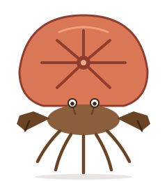

<div align="center">



# Hermit Agent

**A Telegram-connected Claude Code agent. Borrow the shell, bring your own body.**

**Read this in other languages:** [English](README.md) · [中文](README.zh-CN.md)

</div>

---

Hermit Agent productizes a personal-assistant stack built around Claude Code, Telegram, and a small set of markdown files that give the agent persistent identity and memory across restarts. Once set up, every message you send your Telegram bot reaches a long-lived Claude Code session running in a `tmux` pane on your Mac — and every response comes back through Telegram.

The agent is the hermit crab. Claude Code is the shell. Your files are the body.

## Quickstart

Prereqs (macOS):

- [Claude Code](https://docs.claude.com/claude-code) installed and logged in
- Node.js ≥ 18
- `tmux` — `brew install tmux`
- `bun` — `curl -fsSL https://bun.sh/install | bash`
- `jq` — `brew install jq`

Bootstrap your **first** agent (the hub):

```bash
npx create-hermit-agent my-hub
```

The CLI will ask for a Telegram bot token (get one from [@BotFather](https://t.me/BotFather)) and your user ID (get it from [@userinfobot](https://t.me/userinfobot)). It then:

1. Copies the template to `./my-hub/`
2. Registers the telegram plugin at project scope (`claude plugin install -s project`)
3. Writes the bot token to `~/.claude/channels/telegram-my-hub/.env` (mode 600)
4. Runs `npm install` for Playwright (used by the browser-automation skill)

Then:

```bash
cd my-hub
./start.sh
```

DM your bot on Telegram. The agent replies.

## Multi-agent: let your hub spawn siblings

Once you have one hermit, **don't run `npx create-hermit-agent` again**. Instead, tell your hub agent via Telegram:

> "Create a new hermit called `github-bot` with token `123456:ABC…`. Make it triage my GitHub notifications."

The hub's `provision-agent` skill handles the rest — validates the new bot token, scaffolds the directory as a sibling (next to your current working folder), installs the telegram plugin, writes the STATE_DIR, starts the new agent in its own tmux session, and replies with the new bot's `@username`.

That's the intended multi-agent model: one hub, N children, managed conversationally. You only touch the CLI once.

## What it gives you

The same toolkit the author's personal assistant uses — packaged so anyone with a bot token can have one.

**1. Memory & Persona.**
The agent boots every session by reading `SOUL.md` (core behavior), `IDENTITY.md` (name + role), `USER.md` (who it's helping), `AGENTS.md` (workspace rules), `TOOLS.md` (local configs), and `MEMORY.md` (curated long-term). Daily logs live in `memory/YYYY-MM-DD.md`. Restart the session and it still knows who it is, who you are, and what yesterday was about.

**2. Telegram interaction.**
First-class reply / react / edit-message / attachment download. Group-chat etiquette built in (stays quiet unless @mentioned). Prefix any message with `!!` to inject a Claude Code CLI command — `!!compact` trims context, `!!model opus` switches model, `!!status` shows status. Natural-language aliases work too: "compact the context" does the same thing. A `Stop` hook blocks turn-end if a Telegram DM arrived but no reply was sent — silent failure is impossible.

**3. Lifecycle management.**
`./start.sh` boots the agent in a named `tmux` session. `./restart.sh` respawns the pane without losing the Telegram channel, with a plugin-alive check that retries once if the `bun` subprocess didn't come up. Context-tier alerts push a Telegram notification every time the session crosses 100k/200k/400k/600k/800k/950k tokens. Tool-activity alerts ping every 1st + 5th tool call so you can see the agent's heartbeat.

**4. Automation.**
Skills include `restart`, `cron`, `brave-search`, `browser-automation`, and `provision-agent` (the hub spawns siblings). Browser automation uses a self-managed Chrome instance with CDP — explore with `mcp__playwright-browser__*`, record replayable scripts into `scripts/browser/`, run them via `browser-lock.sh` with mutex + watchdog + stealth-init. Cron tasks read the workspace markdown before executing and report back via Telegram.

**5. Safety.**
Every image goes through `scripts/safe-image.sh` before `Read`, resizing to ≤1800px long-edge — an oversized image otherwise silently kills the session. Hard rules against `find /`. No markdown in Telegram replies. No tokens in git-tracked files (`.claude/settings.local.json` is gitignored, `.env` is mode 600 outside the repo, `access.json` is plugin-owned). Multi-agent status reports (opt-in LaunchAgent) digest every agent's state every 10 min and ping you when anything's stuck.

## Architecture

```
┌──────────────────── Your Mac ──────────────────────┐        ┌── Telegram ──┐
│                                                     │        │              │
│   tmux session  claude-<agent>                      │        │  Bot API     │
│   ┌───────────────────────────────────────────┐    │        │  long-poll   │
│   │  claude CLI  (the borrowed shell)          │    │        │              │
│   │  ┌─────────────┐  ┌────────────────────┐  │    │        │              │
│   │  │ Persona     │  │ Skills             │  │    │        │              │
│   │  │ SOUL.md …   │  │ restart · cron ·   │  │    │        │              │
│   │  │ memory/     │  │ provision-agent ·  │  │    │        │              │
│   │  └─────────────┘  │ browser · brave    │  │    │        │              │
│   │                   └────────────────────┘  │    │◄──────►│  @yourbot    │
│   │  ┌─────────────┐  ┌────────────────────┐  │    │        │              │
│   │  │ Hooks       │  │ Scripts            │  │    │        │              │
│   │  │ state …     │  │ safe-image · exec  │  │    │        │              │
│   │  │ reply-check │  │ chrome · status    │  │    │        │              │
│   │  └─────────────┘  └────────────────────┘  │    │        │              │
│   │              │                             │    │        │              │
│   │       Telegram plugin (bun server.ts)      │    │        │              │
│   └──────────────┬────────────────────────────┘    │        │              │
│                  │                                  │        │              │
│  ~/.claude/channels/telegram-<agent>/ (.env, access)│        │              │
└─────────────────────────────────────────────────────┘        └──────────────┘
```

Higher-res SVG: [assets/arch.svg](assets/arch.svg).

## Customizing your agent

Edit these files in the generated agent directory:

- **`IDENTITY.md`** — name, creature, vibe, one-line mission
- **`USER.md`** — who you are (pronouns, timezone, context)
- **`AGENTS.md`** — scroll to the `<!-- MISSION-START -->` block and describe what this agent focuses on
- **`TOOLS.md`** — the `<!-- AGENT-SPECIFIC-START -->` block is where repo links, API keys, and domain notes go
- **`HEARTBEAT.md`** — opt-in periodic check-in script (only relevant if you wire up a cron that reads it)

Don't touch `SOUL.md` unless you intend to change the agent's core disposition.

## Scheduled tasks

Three layers, picked by how long the task must survive:

- **Session-scope** (`cron` skill → `CronCreate`) — dies when the agent restarts. Use for one-shot reminders or probes.
- **HEARTBEAT.md** — a lazy check the agent runs every time a heartbeat fires. Survives restarts. Use when the task needs session context.
- **LaunchAgent plist** (or `crontab`) — OS-level, survives everything short of the Mac rebooting. Use for monitoring, log collection, anything that must not be missed.

See the [full walkthrough in `docs/cron.md`](docs/cron.md). The starter LaunchAgent plist lives at `launchd/cron-example.plist.tmpl` inside the generated agent — copy, edit, `launchctl load`.

## Hub-level status digest

If you run multiple hermits and want the hub to notify you when one gets stuck, enable the LaunchAgent that ships with the template:

```bash
cp launchd/status-reporter.plist.tmpl \
   ~/Library/LaunchAgents/com.hermit-agent.my-hub.status-reporter.plist
launchctl load ~/Library/LaunchAgents/com.hermit-agent.my-hub.status-reporter.plist
```

Every 10 minutes it scans siblings in the parent directory and pushes a digest to the hub's chat: 🟢 idle · 🟨 running · 🟥 stuck · ⚫ down. Only install on one agent per machine — the hub.

## Troubleshooting

| Problem | Fix |
|---|---|
| Agent doesn't reply | `tmux attach -t claude-<name>` and watch the session. Check `claude-agent.log` and `restart.log`. |
| Plugin subprocess missing | `./restart.sh` retries once automatically. If still failing, verify `~/.claude/channels/telegram-<name>/.env` is mode 600 and contains the token. |
| Image dimension crash | Every Read on an image MUST go through `scripts/safe-image.sh` first. If the hook didn't catch it, restart + compact. |
| "claude plugin install failed" | Ensure `claude` CLI is on PATH and you're logged in (`claude login`). |
| Context bloat | `!!compact` on Telegram, or type `/compact` at the tmux pane. |

## Credits

Hermit Agent draws lessons from three projects:

- **[Claude Code](https://docs.claude.com/claude-code)** — the CLI that hosts the agent; this project is literally a hermit crab on top of it.
- **OpenClaw** — the self-managed browser + Chrome profile pattern informed the `chrome-launcher.sh` + `browser-lock.sh` design.
- **Hermes agent** — earlier personal-assistant prototype; the SOUL/IDENTITY/USER/AGENTS/TOOLS/MEMORY file pattern grew from it.

The hermit crab is the only creature that wears a home it didn't build.

## License

MIT — see [LICENSE](LICENSE).
